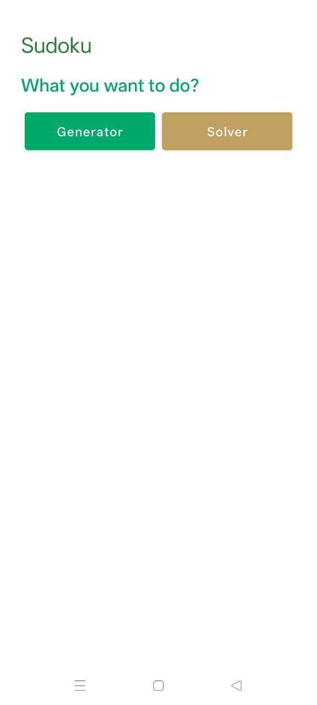
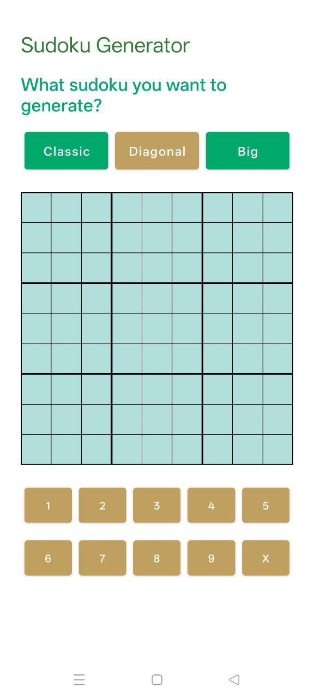
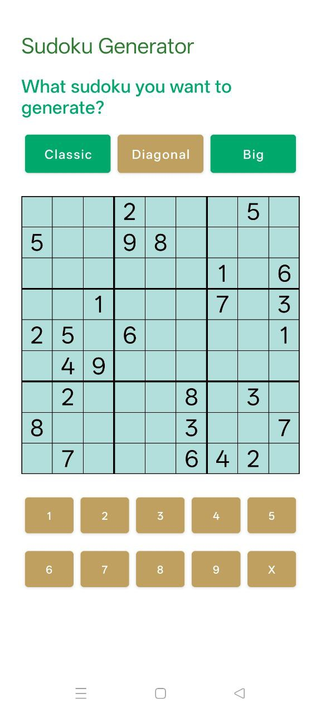
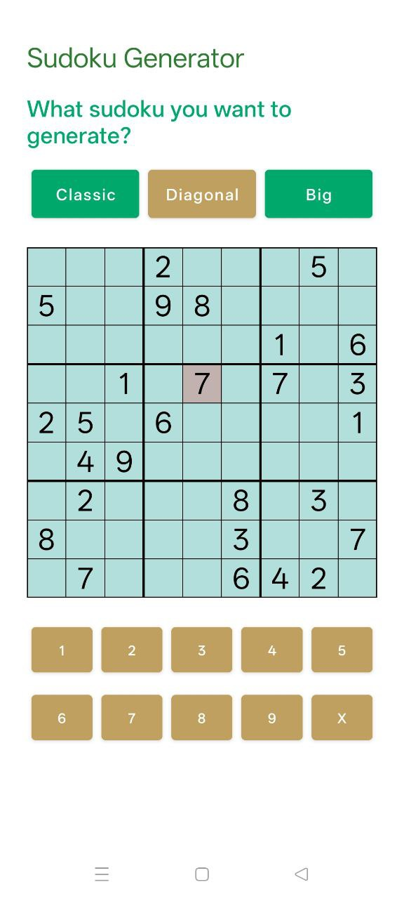

# Sudoku App


## Table of Contents
* [General info](#general-info)
* [Demonstration](#demonstration)
* [Technologies](#technologies)
* [Features](#features)
* [Setup](#setup)

---

## General info
**Sudoku App** is a mobile application for generating and solving Sudoku puzzles.
It supports classic and diagonal Sudoku puzzles in **9x9** and **16x16** sizes.  

In the future, we plan to integrate **OpenCV** and **Tesseract** for Sudoku recognition using a camera and automatic solving.  
Currently, the application allows you to:

- Generate new Sudoku puzzles  
- Solve generated Sudoku puzzles  
- Check the correctness of the solution  

The project was developed using **C++**, **Java**, **Docker**, and standard Android resources.

---

## Demonstration

Now I will demonstrate how my application works.

Here is the initial screen:

  

This is what the Generations page looks like before we make our selection:

  

If we select the type of Sudoku we are interested in, we will see an image of it:

  

Next, we can start solving the Sudoku puzzle and insert the suggested values:

  

However, if we insert an incorrect value, we will not be able to leave it there: 

  

---

## Technologies
The project uses the following technologies:

- **C++** — main logic for generating and solving Sudoku puzzles
- **Java** — Android wrapper for running C++ code on mobile devices
- **Android SDK / XML** — application interface and resources  
- **Docker & Docker Compose** — build containerization and artifact merging  
- **Alpine Linux** — lightweight image for final build  
- **Zip** — packaging results into `sudoku.apk`

---

## Features
Currently, the application allows you to:

- Generate Sudoku puzzles (9x9 and 16x16)
- Check the correctness of the completed puzzle
- Solve the generated Sudoku puzzle

Project architecture:

- **C++** — engine for calculations and generation  
- **Java** — wrapper for running on Android  
- **Resources** — XML markup, styles, and graphic elements  
- **Final Docker Service** — combines the results into a single `sudoku.apk`  

Future plans:

- Scanning Sudoku puzzles with a camera
- Automatic recognition and solving on the device
- Support for additional Sudoku sizes and variants

---

## Setup
The project is fully assembled and launched via **Docker Compose**.  

### Prerequisites
- **Docker** installed: [Docker](https://docs.docker.com/get-docker/)
- **Docker Compose** installed: [Docker Compose](https://docs.docker.com/compose/install/)  

### Steps

1) **Cloning the repository:**
```
git clone https://github.com/username/sudoku-app
cd sudoku-app
```

2) Project structure after cloning:
```
Sudoku/
├── src/
│   ├── main/
│   │   ├── cpp/
│   │   ├── java/
│   │   ├── res/
│   │   └── AndroidManifest.xml
├── DockerCpp/
│   └── Dockerfile
├── DockerJava/
│   └── Dockerfile
├── DockerRes/
│   └── Dockerfile
├── build/
├── docker-compose.yml
└── README.md
```

3) We launch the assembly of all containers via Docker Compose:
```
docker-compose up --build
```

4) What happens during assembly:
- cpp — compiles C++ code, the result is saved in build/cpp.txt
- java — compiles Java code, the result is saved in build/java.txt
- res — prepares resources and manifest, the result is saved in build/res.txt
- final — combines all artifacts and creates sudoku.apk in the build/ folder

5) After a successful launch, the following will appear in the build/ folder:
```
build/
├── cpp.txt
├── java.txt
├── res.txt
├── result.txt
└── sudoku.apk
```

6) Stop all containers:
```
docker-compose down
```
Notes
- All intermediate results are saved in the build/ folder.
- sudoku.apk can be installed on an Android device or emulator for testing.
- The project can be developed further by adding new features and improving the UI/UX.


## Dockerfiles Explained
The project uses four containers: **cpp**, **java**, **res**, and **final**. Below is a detailed description of each.

---

### 1. DockerCpp
**Purpose:** compiles a C++ engine for generating and solving Sudoku puzzles.  

**Dockerfile:**
```dockerfile
FROM alpine:latest
WORKDIR /app/cpp
COPY ../src/main/cpp/ /app/cpp
CMD ["sh", "-c", "echo 'C++ compiled OK' > /app/build/cpp.txt && tail -f /dev/null"]
```

What it does:
- Uses the lightweight Alpine Linux image
- Copies C++ source code into the container
- Simulates compilation (currently just writes cpp.txt)
- Keeps the container active with tail -f /dev/null

### 2. DockerJava
**Purpose:** compiles Java wrapper for Android.

**Dockerfile:**
```dockerfile
FROM alpine:latest
WORKDIR /app/java
COPY ../src/main/java/ /app/java
CMD ["sh", "-c", "echo 'Java compiled OK' > /app/build/java.txt && tail -f /dev/null"]
```

What it does:
- Copies Java code to the container
- Simulates compilation, creates java.txt
- The container remains active for subsequent builds

### 3. DockerRes
**Purpose:** Prepares Android resources (XML, manifest, images).

**Dockerfile:**
```dockerfile
FROM alpine:latest
WORKDIR /app/res
COPY ../src/main/res/ /app/res
COPY ../src/main/AndroidManifest.xml /app/
CMD ["sh", "-c", "echo 'Resources ready' > /app/build/res.txt && tail -f /dev/null"]
```

What it does:
- Copies the folder with resources and AndroidManifest.xml
- Creates res.txt to confirm successful copyin
- The container remains active for the final build

### 4. Final Container
**Purpose:** collects all artifacts (cpp.txt, java.txt, res.txt) into a single APK file.

Dockerfile (not required, uses alpine:latest image in docker-compose.yml):
```yaml
final:
  image: alpine:latest
  volumes:
    - ./build:/app/build
  command: >
    sh -c "cd /app/build &&
           cat cpp.txt java.txt res.txt > result.txt &&
           zip sudoku.apk result.txt"
```

What it does:
- Uses a shared volume build to access files from previous containers.
- Combines texts from all containers into result.txt.
- Packs result.txt into sudoku.apk.

### Summary
Each container is responsible for a separate stage of assembly:

Container              Purpose
cpp                    C++ generation/resolution engine
java                   Android wrapper in Java
res                    Android resources (XML, manifest)
final                  Combining all artifacts and creating sudoku.apk

This approach ensures modularity, repeatability of the build, and ease of debugging on any computer.
